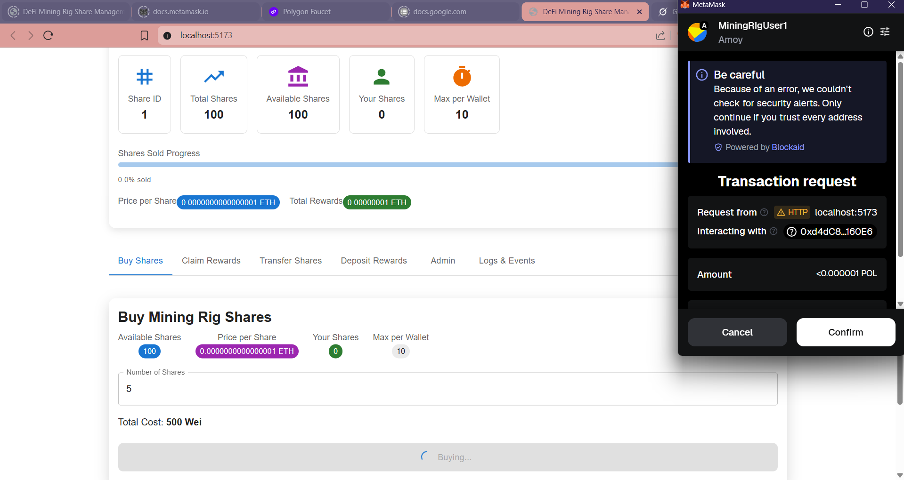
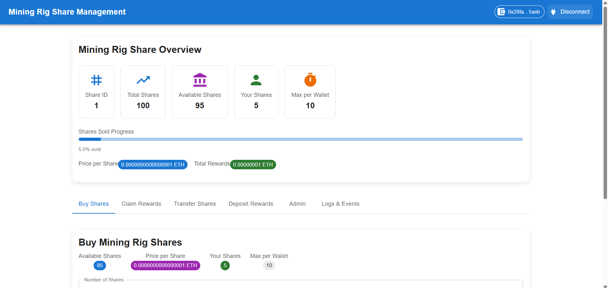
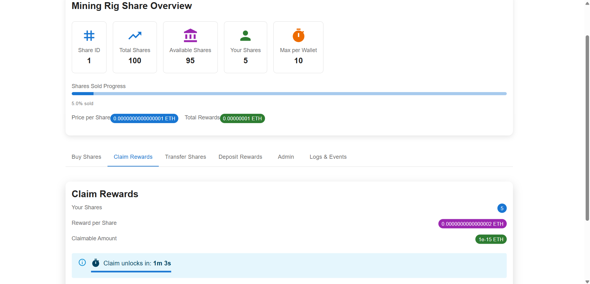
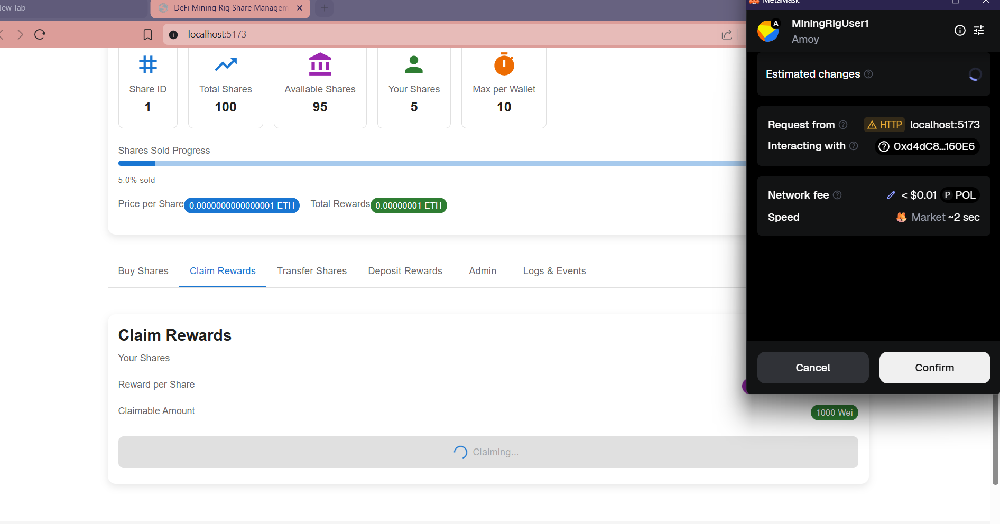
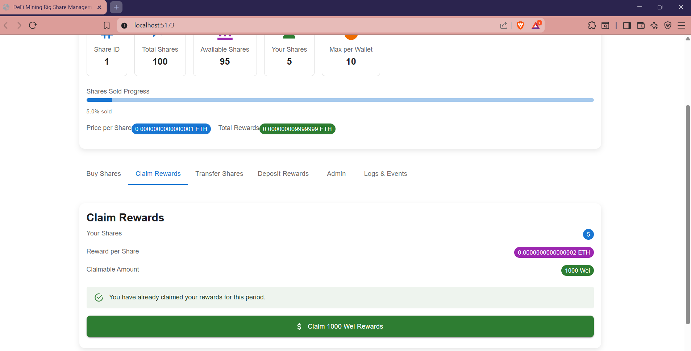
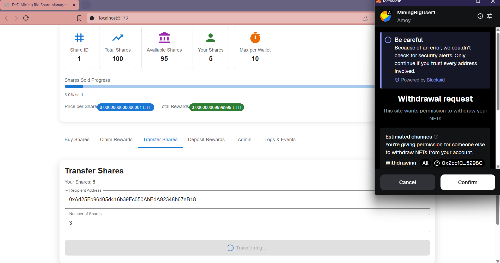
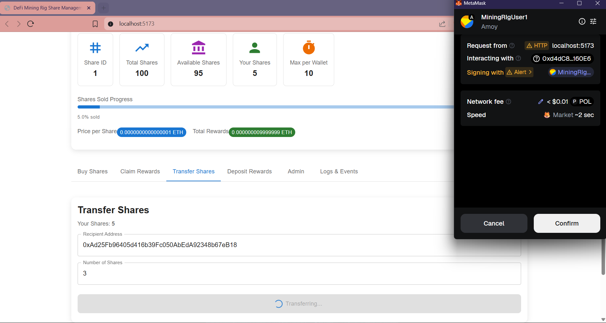
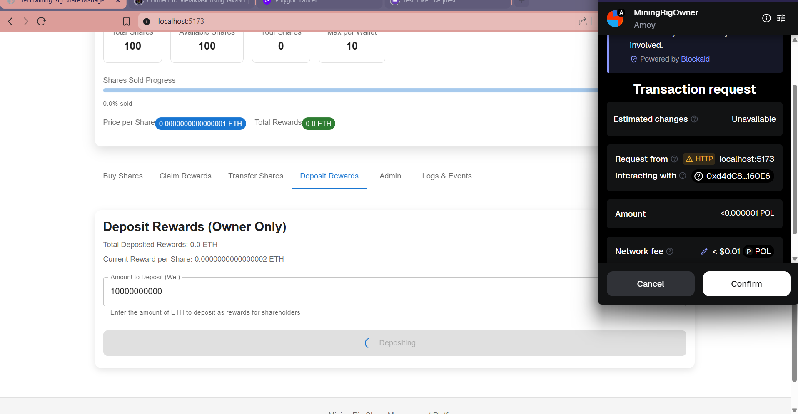

# Mining Rig Share Management DApp

A comprehensive decentralized application for managing mining rig shares on Ethereum (Polygon Amoy), built with React, TypeScript, Material UI, and Ethers.js.
## Frontend Deploy
Netlify Deployed Link: [https://fractional-mining-rig-dapp.netlify.app/](https://fractional-mining-rig-dapp.netlify.app/) 
## Overview

**Fractional Mining** is a decentralized application (dApp) that enables users to purchase and manage fractional ownership shares of a mining rig on the Polygon Amoy testnet. Multiple users can collectively own a mining rig by purchasing shares (represented as tokens) using ETH. Each share entitles the holder to a portion of the mining rewards generated by the rig, proportional to ownership.  
The dApp interacts with two smart contracts:
- **MiningRigShare**: Manages share purchases and total share supply.
- **MiningRigOwnership**: Handles ownership details, reward deposits, and mining rig registration.


## Features

- **Wallet Integration**: Connect/disconnect MetaMask wallet with automatic network switching
- **Share Management**: Buy shares with automatic price calculation and validation
- **Rewards System**: Claim rewards with lock period countdown and real-time updates
- **Admin Functions**: Owner-only mining rig registration and reward deposits
- **Share Transfers**: ERC-1155 compliant share transfers with claim requirement
- **Event Logging**: Real-time transaction status and contract event monitoring
- **Responsive Design**: Mobile-first design with Material UI components


## Contract Features

### MiningRigOwnership Contract
- Register mining rigs (owner only)
- Deposit rewards for shareholders
- Track mining rig metadata and total rewards

### MiningRigShare Contract (ERC-1155)
- Buy shares with ETH payment
- Claim proportional rewards
- Transfer shares after claiming rewards
- Track balances and claim periods

## Setup & Installation

### Prerequisites

- **Node.js**: 18+
- **MetaMask**: Installed, configured for Polygon Amoy.
- **Polygon Amoy Testnet**:
  - Chain ID: 80002
  - RPC URL: `https://rpc-amoy.polygon.technology/`
  - Explorer: [https://amoy.polygonscan.com/](https://amoy.polygonscan.com/)
- **Test MATIC/ETH**: Required for gas/transactions (use Polygon Amoy/Alchemy faucet).
- **Hardhat**: For contract deployment and generating ABIs.

### Installation
Below is the entire content ready to be placed in a single README.md file. Copy and paste the following as-is; this is fully self-contained and does not require any additional files for documentation:

text
# Fractional Mining dApp

## Overview

**Fractional Mining** is a decentralized application (dApp) that enables users to purchase and manage fractional ownership shares of a mining rig on the Polygon Amoy testnet. Multiple users can collectively own a mining rig by purchasing shares (represented as tokens) using ETH. Each share entitles the holder to a portion of the mining rewards generated by the rig, proportional to ownership.  
The dApp interacts with two smart contracts:
- **MiningRigShare**: Manages share purchases and total share supply.
- **MiningRigOwnership**: Handles ownership details, reward deposits, and mining rig registration.

The frontend is a React application using TypeScript, Material-UI, and Vite, with ethers.js for blockchain operations and MetaMask for wallet connectivity.

## Features

- **Wallet Connection**: Connect MetaMask with the Polygon Amoy testnet.
- **Share Purchasing**: Buy mining rig shares using ETH.
- **Contract Status**: Display real-time contract state, including all share/reward stats.
- **Reward Deposits**: Authorized users can deposit ETH mining rewards.
- **Responsive UI**: Material-UI interface for all features.

## Prerequisites

- **Node.js**: 18+
- **MetaMask**: Installed, configured for Polygon Amoy.
- **Polygon Amoy Testnet**:
  - Chain ID: 80002
  - RPC URL: `https://rpc-amoy.polygon.technology/`
  - Explorer: [https://amoy.polygonscan.com/](https://amoy.polygonscan.com/)
- **Test MATIC/ETH**: Required for gas/transactions (use Polygon Amoy/Alchemy faucet).
- **Hardhat**: For contract deployment and generating ABIs.

## Setup Instructions

1. **Clone Repository**

```bash
    git clone https://github.com/Ashishk279/Fractional-Mining-Rig-DApp.git
    cd Fractional-Mining-Rig-DApp
```

2. **Install Dependencies**

```bash
    npm install
```

3. **Configure contract addresses**
   - Open `src/contexts/ContractContext.tsx`
   - Replace the placeholder contract addresses with your deployed contract addresses:
   ```typescript
   const CONTRACT_ADDRESSES = {
     OWNERSHIP: "YOUR_OWNERSHIP_CONTRACT_ADDRESS",
     SHARE: "YOUR_SHARE_CONTRACT_ADDRESS",
   };
   ```

3. **Configure owner address**
   - Open `src/contexts/WalletContext.tsx`
   - Replace the owner address:
   ```typescript
   const OWNER_ADDRESS = "YOUR_OWNER_WALLET_ADDRESS";
   ```

4. **Start the development server**
```bash
npm run dev
```

6. **Deploy to Production**

```bash
npm run build
```
Deploy contents of the `dist` folder to your hosting platform (e.g., Vercel, Netlify).
## MetaMask Setup for Arbitrum Sepolia

### Automatic Setup
The application will automatically prompt you to add/switch to Arbitrum Sepolia when you connect your wallet.

### Manual Setup
If needed, add Arbitrum Sepolia network manually:

**Network Details:**
- Network Name: `Polygon Amoy`
- RPC URL: `https://rpc-amoy.polygon.technology/`
- Chain ID: `80002`
- Currency Symbol: `POL`
- Block Explorer: `https://amoy.polygonscan.com/`

### Getting Test POL
1. Get Sepolia ETH from a faucet like [Polygon Amoy Faucet](https://faucet.polygon.technology/)

## Usage Guide

### For Regular Users

1. **Connect Wallet**: 
   - Press "Connect Wallet" in the app.
   - Allow MetaMask to connect and switch to Polygon Amoy.
   - Ensure the account has test MATIC and ETH.
2. **Buy Shares**: 
   - Use the **BuyShares** component.
   - Enter desired share amount, review estimated ETH total, and submit via MetaMask.
   - Example cost: 0.0000000000000005 ETH for 5 shares at 0.0000000000000001 ETH each.
   
   - When your transaction is confirmed. Your shares are updated
   
3. **Claim Rewards**:
   - Wait for the claim period to end (countdown displayed)
   
   - Navigate to "Claim Rewards" tab
   - Click "Claim" to receive your ETH rewards
   
   - Once Transaction successfull.
   
4. **Transfer Shares**:
   - Only available after claiming rewards
   - Enter recipient address and amount
   - Confirm the ERC-1155 transfer
   - First you give the approval where ownership contract transfer the ERC-1155 behalf of you.
   
   - Once Approval Transaction successfull then you sign the transfer ERC-1155 Token
   
5. **View Contract Status**

   - The **ContractStatus** component shows share stats, user holdings, shares available, rewards, price per share, and more.

### For Contract Owner

1. **Register Mining Rig**:
   - Navigate to "Admin" tab
   - Enter rewardPerShare and perShareValue in Wei
   - Submit registration transaction
2. **Deposit Rewards**:
   - Navigate to "Deposit Rewards" tab
   - Enter Wei amount to distribute to shareholders
   - Confirm the deposit transaction
   

### Monitoring

- **Transaction Logs**: View real-time status of your transactions
- **Contract Events**: Monitor all contract interactions and events
- **Share Progress**: Track total shares sold and available
- **Reward Tracking**: See total deposited rewards and per-share distribution

## Error Handling

The application includes comprehensive error handling for common scenarios:

- **Network Issues**: Automatic retry and user-friendly error messages
- **Transaction Failures**: Detailed error messages from contract reverts
- **Input Validation**: Frontend validation before transaction submission
- **Wallet Connection**: Clear status indicators and connection prompts

## Security Features

- **Role-based Access**: Owner-only functions restricted by wallet address
- **Input Validation**: All inputs validated before contract interaction
- **Network Verification**: Ensures users are on correct network (Arbitrum Sepolia)
- **Transaction Confirmation**: All transactions require MetaMask confirmation

## Development

### Building for Production
```bash
npm run build
```

### Linting
```bash
npm run lint
```

### Project Structure
```
src/
├── components/          # UI components
├── contexts/           # React contexts for state management
├── contracts/          # Contract ABIs and configurations
├── types/             # TypeScript type definitions
├── App.tsx            # Main application component
└── main.tsx           # Application entry point
```

## Troubleshooting

### Common Issues

1. **MetaMask Not Detected**
   - Ensure MetaMask extension is installed and enabled
   - Refresh the page after installing MetaMask

2. **Wrong Network**
   - The app will automatically prompt to switch to Arbitrum Sepolia
   - Manually add the network if auto-switch fails

3. **Transaction Failures**
   - Check you have enough ETH for gas fees
   - Verify you're not exceeding share limits
   - Ensure contract addresses are correct

4. **Contract Not Found**
   - Verify contract addresses in `ContractContext.tsx`
   - Ensure contracts are deployed on Arbitrum Sepolia
   - Check contract ABIs match deployed contracts

## License

MIT License - see LICENSE file for details.
